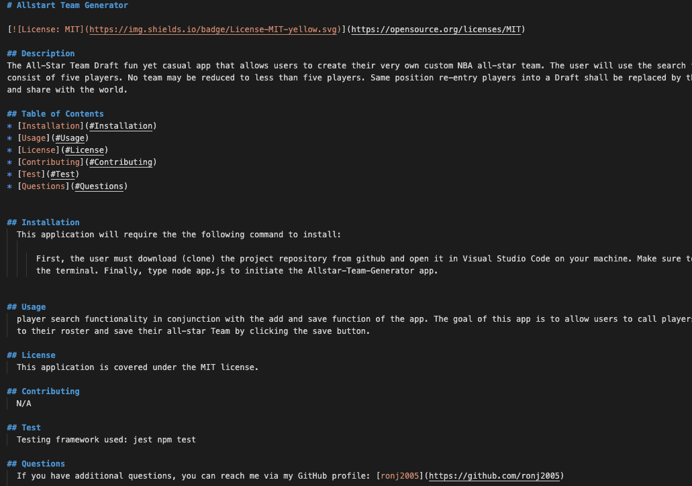
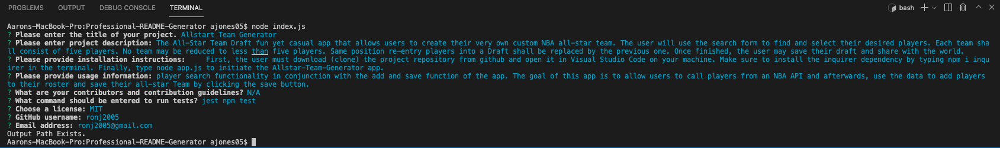

# Resume Generator
 
## Description

This is a site created to showcase my work and skill sets to potential employers.

This site will see posts that include previous works created by me as well as an updated blog section to log the various changes to current works in progress.

The goal for this portfolio site is for me to journal my progress as a developer. I welcome all users to access and view my current and past projects along with my provided contact information to connect with me for possible work and employment.

## Table of Contents
* [Installation](#Installation)
    * [Usage](#Usage)
    * [License](#License)
    * [Contributing](#Contributing)
    * [Test](#Test)
    * [Questions](#Questions)
    
    
## Installation
    First, the user must download (clone) the project repository from github and open it in Visual Studio Code on your machine. Make sure to INSTALL the inquirer dependency by typing npm i inquirer in the terminal. Finally, type node app.js to initiate the Proffesional-README-Generator app.

or

    download the index.html from the GitHub repo link provided below.
    Repo Link: https://github.com/ronj2005/Aaron-Jones-Developer-Portfolio

or

    copy the link to the site url to access the remote site.
    Direct Link: https://ronj2005.github.io/Aaron-Jones-Developer-Portfolio/
    
## Usage
Open the index.html file in your browser of choice.

By clicking the links in the navigation bar, users will be able to access content associated to those links.

## Generated README:

 

## Prompt Question in Terminal:

video link: https://watch.screencastify.com/v/X7kRFPExTlZuYkM5V95r

## License
N/A
## Contributing
N/A
## Test
npm test
## Questions
If you have additional questions, you can reach me via my GitHub profile: [ronj2005](https://github.com/ronj2005)
or 
send me an email at: ronj2005@gmail.com
    